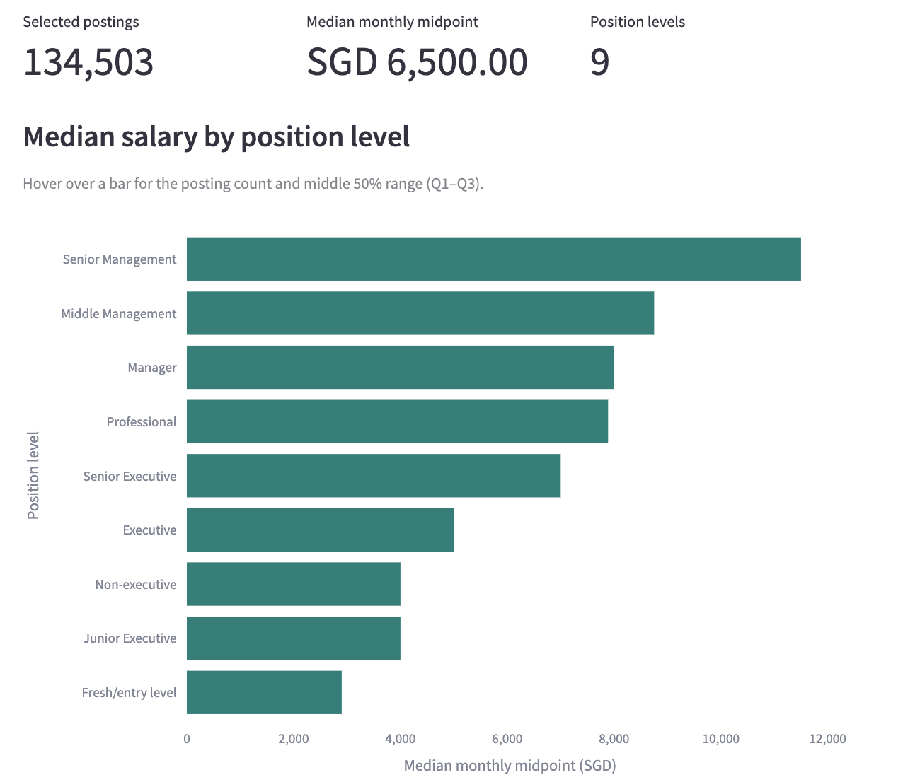
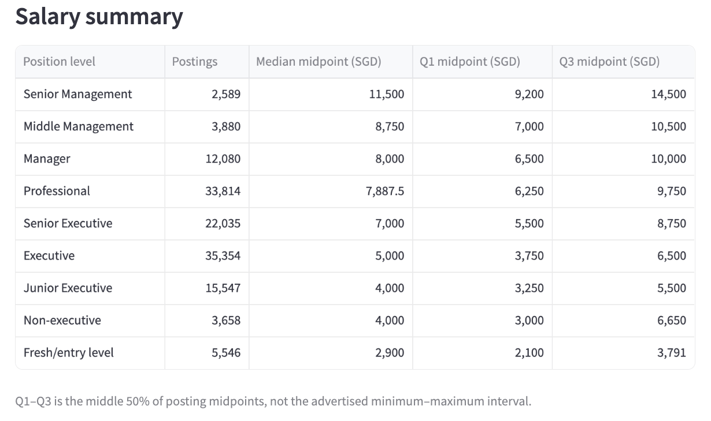
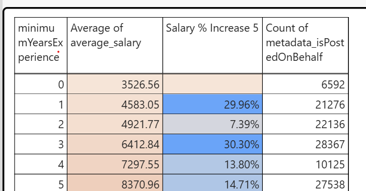
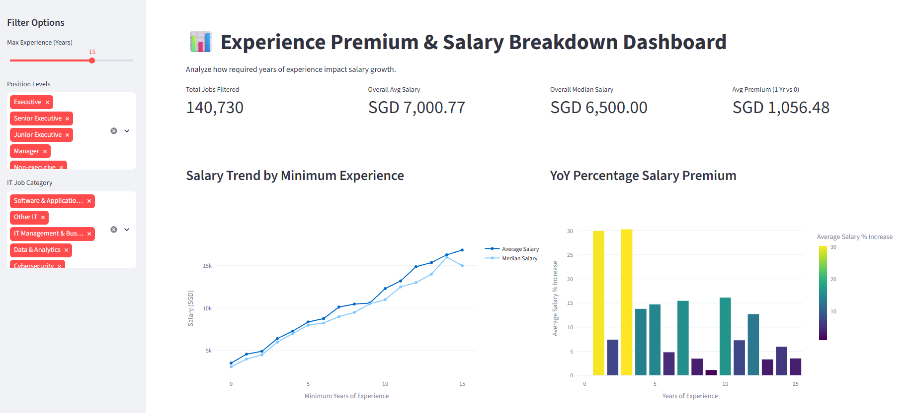
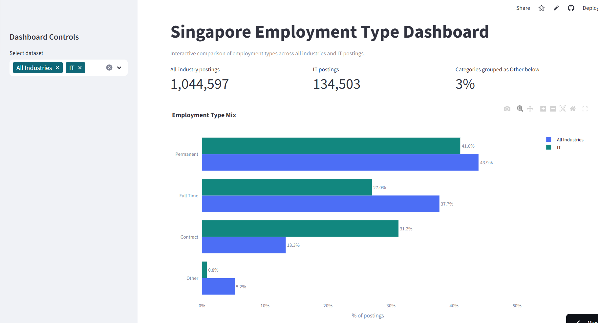
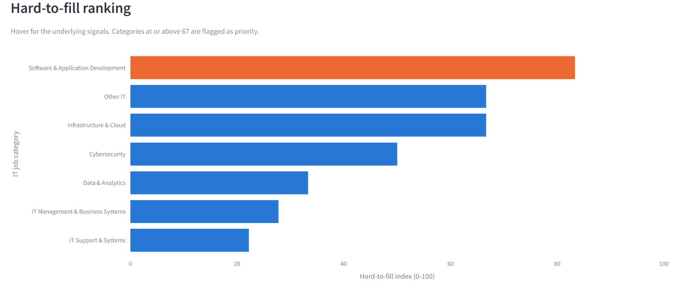
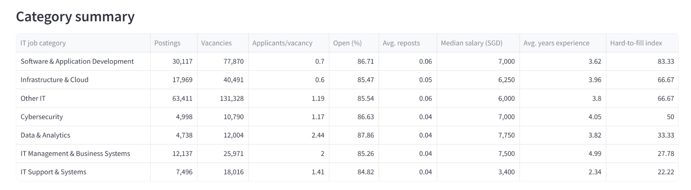

### Rachelle case：Salary benchmark by position level

<strong>Owner</strong>: Rachelle Congrui Liu (C).

<strong>Business question</strong>: How do advertised salary benchmarks differ by position level

<strong>Dashboard：</strong><a href="https://group5-singapore-it-salary.streamlit.app/">https://group5-singapore-it-salary.streamlit.app/</a>

<strong>1) Data Selection and Calculation: </strong>Each posting’s monthly salary midpoint is calculated as (minimum + maximum salary) ÷ 2. Across 134,503 eligible postings, the overall median midpoint is SGD 6,500, and each bar shows the median midpoint for one of the nine position levels.

- <strong>Selected postings:</strong> Count eligible records = <strong>134,503</strong>.

- <strong>Salary midpoint Formula :</strong> (Minimum + Maximum monthly salary) ÷ 2.

- <strong>Overall median:</strong> Median of all selected midpoints = <strong>SGD 6,500</strong>.

- <strong>Each bar:</strong> Median salary midpoint for that position level.

- <strong>Q1–Q3:</strong> 25th–75th percentiles, showing the middle 50%.

### 2) Dashboard view or screenshot

### 

<strong>3) Key Findings and HR Recommendation</strong>

<strong>Key findings</strong>

- <strong>Overall median salary:</strong> SGD <strong>6,500/month</strong>.

- <strong>Large pay gap by level:</strong> Senior Management has the highest median (<strong>SGD 11,500</strong>), while Fresh/Entry Level has the lowest (<strong>SGD 2,900</strong>).

- <strong>Management title ≠ higher pay:</strong> Manager (<strong>SGD 8,000</strong>) and Professional (<strong>SGD 7,887.50</strong>) differ by only <strong>SGD 112.50</strong>, with overlapping Q1–Q3 ranges.

<strong>HR recommendations: </strong>

- <strong>Pay for role scope, not title：</strong>Manager and Professional salaries are almost identical, so HR should benchmark based on responsibilities and skills, rather than assuming a management title deserves higher pay.

- <strong>Prioritise high-demand talent segments：</strong>Use posting volume + salary level together to identify roles where hiring demand is high and adjust recruitment budgets accordingly.

<strong>3.2 Experience premium</strong>

<strong>Owner: </strong>Jen Ho

<strong>Business question: </strong>How does advertised pay vary with required experience?

### 1) Data selection and calculation

### Data Used : minimumYearsExperience; average_salary; positionLevels

Formula:

% Change = (This year salary - previous previous salary) / previous year salary

Table plotted based on minimum years of experience

Sample of the data result (Top 6 records)

### 2) Dashboard view or screenshot

### 3) Key findings and HR recommendation

- <strong>Significant increase Years (Years 1, 3, 5, 10):</strong> Salary growth peaks sharply at specific career inflection points. <strong>Year 1</strong> (+29.96%) marks the transition out of fresh graduate tiers, <strong>Year 3</strong> (+30.30%) reflects transition to independent executive roles, and <strong>Years 5, 7, and 10</strong> represent standard management thresholds where compensation jumps by +SGD 1,000–1,700+.

- <strong>Plateau Years (Years 2, 6, 8, 9):</strong> Intermediate years show modest gains (+1.10% to +7.39%), indicating that incremental experience within the same responsibility bracket yields minimal salary adjustments compared to jumping across experience tiers.

- <strong>Early Career Multiplication:</strong> Between <strong>Year 0</strong> and <strong>Year 5</strong>, median base pay more than doubles from <strong>SGD 3,100</strong> to <strong>SGD 8,000</strong>, delivering average yearly gains of ~SGD 1,000.

## 3.3 Contract vs permanent

<strong>Owner:</strong> Wong Siew Yin

<strong>Business question: </strong>What employment mix appears in the market?

### 1) Data selection and calculation

Two datasets were used for this analysis: all job postings across all industries, used as the market-wide baseline, and IT.

<strong>Calculation method</strong>

For each dataset, postings were grouped by employment type using pandas' value_counts(), and each type's share of postings was calculated as:

Percentage = (Number of postings in that employment type ÷ Total postings in the dataset) × 100

Employment types individually representing a small minority of a dataset's postings were combined into a single "Other" category. Counts and percentages were then recalculated on this regrouped set. The resulting charts show the distribution of employment types, by posting count and by percentage, for both the all-industries baseline and the IT dataset.

### 2) Dashboard view or screenshot

<strong></strong>

<strong>3) Key findings and HR recommendation</strong>

<strong>Key findings</strong>

Permanent hiring is still more common in both groups, but the gap is much smaller in IT. Market-wide, there are about 3.3 Permanent postings for every 1 Contract posting (43.9% vs 13.3%). In IT, that drops to about 1.3 to 1 (41.0% vs 31.2%). Contract hiring is more than twice as common in IT as in the rest of the market, and it's close to becoming as common as Permanent hiring, rather than being a small minority option.

<strong>HR recommendation</strong>

With contract roles making up 31.2% of IT postings compared to just 13.3% across the market, and Permanent still leading in both, HR and hiring teams need to plan for contract hiring as a standard part of recruiting for IT, not treat it as a one-off exception. Compensation should still be benchmarked separately for contract and permanent roles, since the two involve different hiring and budgeting decisions  

## 3.4 Which IT job categories are high demand and hard to fill

<strong>Owner:</strong> Adelene Soh Puay Siam

<strong>Business question:</strong> Which IT Job categories are high demand and hard to fill

### 1）Data selection and calculation

The IT postings are broken down into 7 ‘it_job_category’ buckets.

To flag a category as “hard to fill”, three signals are combined (each converted to a 0-100 rank score across the 7 categories, then averaged into a ‘hard_to_fill_index’):

- Demand : number of job postings (more postings = more hiring demand).

- Scarcity : applicants per vacancy (‘total_applications / total_vacancies’); the fewer applicants per open role, the scarcer the candidate pool.

- Backlog - % of postings still ‘open’ (not yet ‘Closed’/’Re-open’); a high proportion left open signals employers are struggling to close out the role.

“metadata_repostCount’ (reporting = a re-advertised, unfilled role) is reported alongside as a supporting signal, though it’s rare in this dataset (94% of postings were never reposted) so it’s not weighted into the index.

### 2）Dashboard view or screenshot

### 3）Key findings and HR recommendation

Software &amp; Application Development - is the clearest high-demand, hard-to-fill category, the most postings after the “Other IT” catch-all, the fewest applicants per vacancy (0.70) of any specific specialism, and 86.7% of its postings are still ‘Open’.

<strong>Infrastructure &amp; Cloud </strong>- has the single scarcest candidate pool in the dataset (0.6 applicants per vacancy - the lowest of all 7 categories) combined with strong demand (2nd-highest posting volume), making it the #2 priority.

<strong>Data &amp; Analytics </strong>- is a special case: it has the “best” applicant supply (2.44 applicant/vacancy) yet the highest share of postings still open (87.9&amp;). That combination points to a <em>qualification/skills mismatch, </em>not a sourcing- volume problem.

<strong>IT Support &amp; Systems</strong> - is the easiest category to fill (lowest ‘hard_to_fill_index’, lowest pay, fastest close-out).

<strong>Other IT </strong>- is the largest bucket by raw volume (65k postings) but is a catch-all label rather than a real specialisation - its applicants-per-vacancy (1.19) is healthier than Software &amp; Application Development and IT Support &amp; Systems, so raw volume alone overstates how “hard to fill” it really is. This is a data-labeling limitation and would need further review.

## 4. Presentation Challenges and Learnings

### Challenges and learnings

- <strong>Salary Data Requires Multiple Checks. </strong>Salary midpoint alone cannot determine whether a record is reasonable. Some postings may have an unusually low minimum salary, a very high maximum salary, or an excessively wide salary range. Therefore, both IQR screening and salary-band checks are used. Flagged records are not necessarily errors, so the original records and review reasons are retained.

- <strong>Labels need context. </strong>Source position levels represent different career tracks rather than a strict promotion ladder. Title-keyword classification depends on matching order and may misclassify ambiguous roles. Similar functions should be compared before attributing salary differences to seniority.

- <strong>Consistent denominators matter. </strong>A multi-category posting must not be counted repeatedly as distinct demand. Use unique posting IDs after category expansion. An all-industry comparator for the employment-mix topic requires the wider source population, not only the IT master dataset.

- <strong>Advertisements have limits. </strong>The data records offered salary ranges rather than accepted compensation. Posting counts show advertised demand and cannot establish candidate scarcity. Experience-pay differences can also reflect job function and seniority. The historical period limits application to current hiring.

### Next steps

Review how results change under alternative salary thresholds, manually validate a sample of keyword classifications and refresh the dataset before current hiring decisions.
